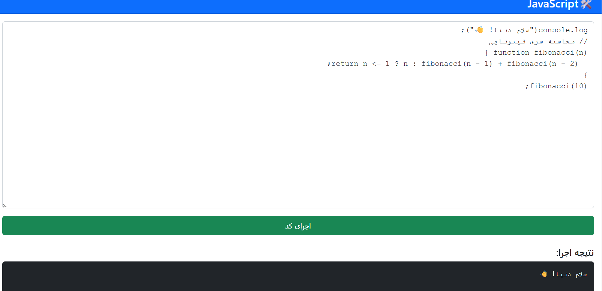

# 🧠 Practice Repository — JavaScript & Python

Welcome to the **practice_js** repository!  
This is a collection of hands-on coding exercises using **JavaScript** and **Python**, designed to help reinforce core concepts and improve problem-solving skills.

---

## 📂 Project Structure

This repo contains:
- ✅ JavaScript exercises and mini projects (DOM, functions, events, etc.)
- ✅ Python practice scripts for logic building and automation
- ✅ HTML/CSS files for UI-based JS projects
- ✅ `screenshots/` folder for visual previews of some projects

---

## 🎯 Objectives

- Master fundamental programming concepts
- Practice DOM manipulation and event handling in JavaScript
- Work with Python for scripting and basic problem-solving
- Prepare for coding interviews and real-world challenges

---

## 🖼 Screenshots

Below is an example of one of the projects in action:

<p align="center">
  
</p>

---

## 🚀 Getting Started

### 🔧 Clone the Repo
```bash
git clone https://github.com/YALDAKHOSHPEY/practice_js.git
```

---
